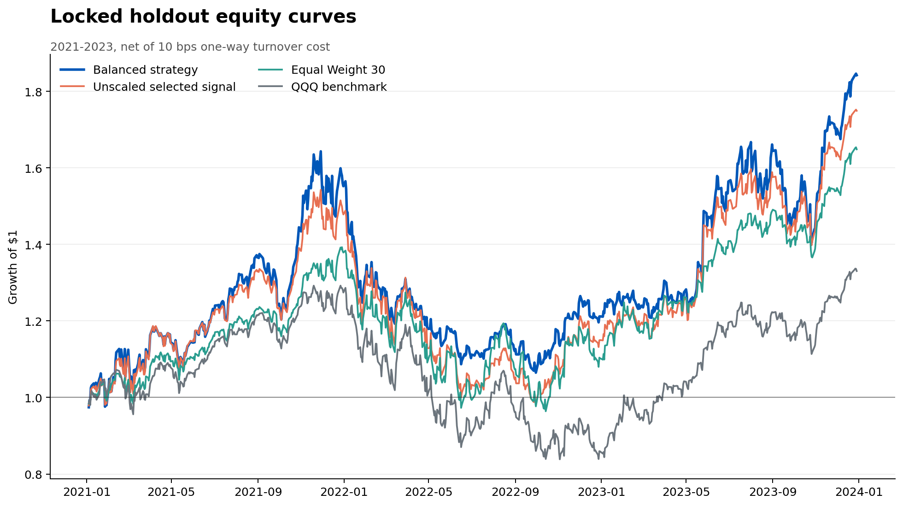

# Balanced QuantAgents-Style Reproduction

This repository tests a transparent middle ground between an unlevered
cross-sectional strategy and the aggressively levered version previously used
to match the paper's headline return. It does **not** optimize toward the
article's ARR, total return, Sharpe ratio, or drawdown.

## Holdout result

The configuration was selected using data through 2020 and evaluated once on a
locked 2021-2023 holdout. Returns include a 10 bps one-way turnover cost.

| Strategy | Total return | ARR | Sharpe | Max drawdown | Annual volatility |
|---|---:|---:|---:|---:|---:|
| **Balanced strategy** | **84.22%** | **22.69%** | **0.917** | **35.20%** | **25.98%** |
| Unscaled selected signal | 74.92% | 20.58% | 0.851 | 36.35% | 25.96% |
| Equal Weight 30 | 64.85% | 18.21% | 0.846 | 30.79% | 22.88% |
| QQQ benchmark | 33.04% | 10.02% | 0.521 | 35.12% | 23.76% |

## What makes the test honest

- Signal and risk choices are selected only from observations dated 2020 or earlier.
- The balanced score rewards Sharpe, Calmar, rolling-window stability, and lower turnover.
- Validation constraints cap drawdown and volatility instead of targeting paper returns.
- All positions are delayed by one trading day after signal formation.
- Volatility and drawdown controls use lagged data only.
- Gross exposure has a hard 1.25x cap in the selected model.
- Results include explicit turnover costs and retain losing years.
- Input files are frozen and recorded with SHA-256 hashes in the run manifest.

## Strategy

The selected signal ranks 30 stocks by 120-trading-day momentum at each month
end, holds the top eight at equal weight, and rebalances monthly. A causal
volatility budget and drawdown governor adjust total exposure. The final
configuration was chosen from a pre-defined grid on 2018-2020; 2021-2023 did not
participate in selection.

The paper's reported metrics remain in `results/article_context.csv` for
context only. They are not treated as a target because the available data,
universe, execution assumptions, and agent architecture do not fully match the
paper.

## Main artifacts

- `results/performance_comparison.csv`: holdout metrics versus baselines.
- `results/validation_leaderboard.csv`: every validation candidate that passed constraints.
- `results/daily_positions.csv`: auditable holdout allocations.
- `results/daily_diagnostics.csv`: exposure, turnover, costs, and control states.
- `results/run_manifest.json`: exact configuration, data hashes, runtime, and limitations.
- `figures/drawdown_and_exposure.png`: drawdown and leverage behavior.

